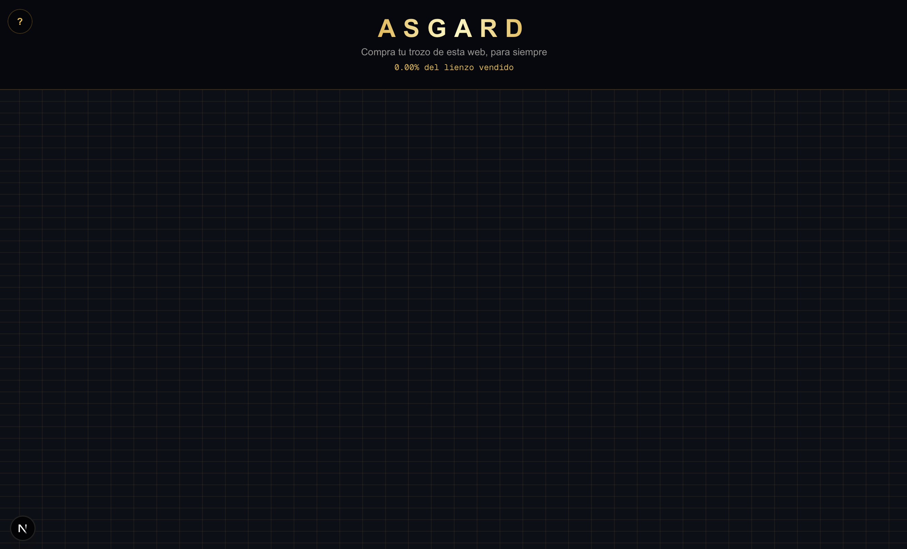

# ASGARD

*Compra tu trozo de esta web, para siempre*

**Asgard** es una web que vende sus propios píxeles como espacio publicitario. Cualquier visitante puede seleccionar un área del lienzo, subir una imagen y un enlace, pagar de forma segura, y ver su anuncio publicado de forma permanente — al estilo del clásico "Million Dollar Homepage", pero adaptado a un lienzo que ocupa toda la pantalla y se adapta a cualquier resolución.

## ¿En qué se basa?

La idea es sencilla: en lugar de vender espacio publicitario en formatos fijos y predefinidos, Asgard convierte el propio sitio web en un lienzo infinito de anuncios. Cada comprador elige exactamente qué porción de pantalla quiere, a un precio proporcional al tamaño del área seleccionada, y su imagen queda visible ahí para siempre.

## ¿Qué hace?

- Permite seleccionar libremente cualquier rectángulo del lienzo, sin bloques predefinidos.
- Calcula el precio en tiempo real según el tamaño del área seleccionada.
- Procesa el pago de forma segura mediante Stripe.
- Modera cada compra manualmente antes de publicarla, para evitar contenido inapropiado o enlaces fraudulentos.
- Incluye un panel de administración privado para revisar y aprobar/rechazar compras.
- Incorpora protección contra abuso (límite de peticiones, validación de imágenes) y un modo de mantenimiento para desactivar las compras temporalmente sin afectar al resto del sitio.

## Tecnologías utilizadas

- **[Next.js 16](https://nextjs.org/)** (App Router, Turbopack) con **React 19** y **TypeScript**
- **[Tailwind CSS v4](https://tailwindcss.com/)** para el diseño
- **[Supabase](https://supabase.com/)** — base de datos Postgres, autenticación y almacenamiento de imágenes
- **[Stripe Checkout](https://stripe.com/checkout)** — procesamiento de pagos
- Desplegado en **[Vercel](https://vercel.com/)**